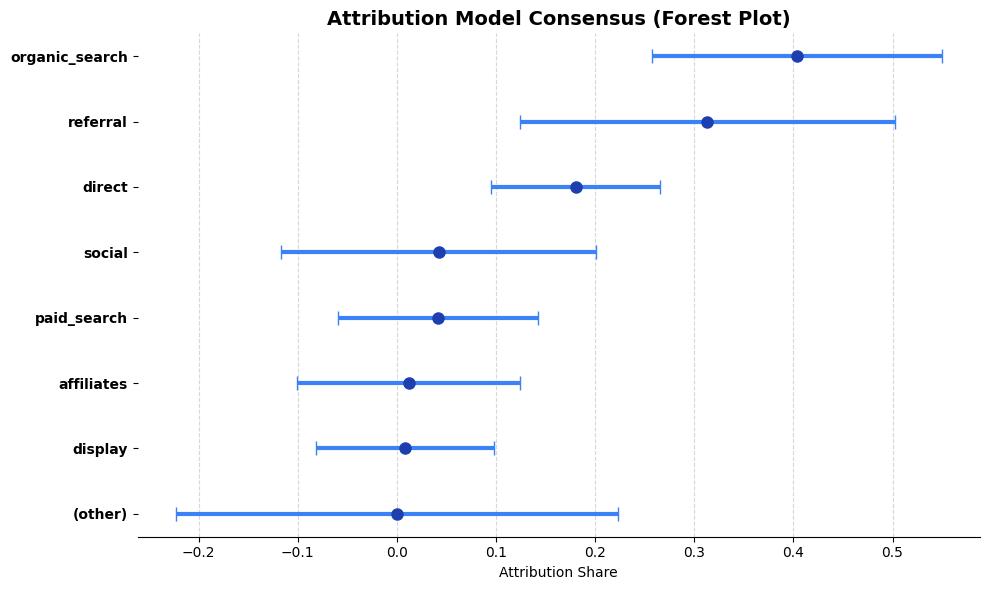
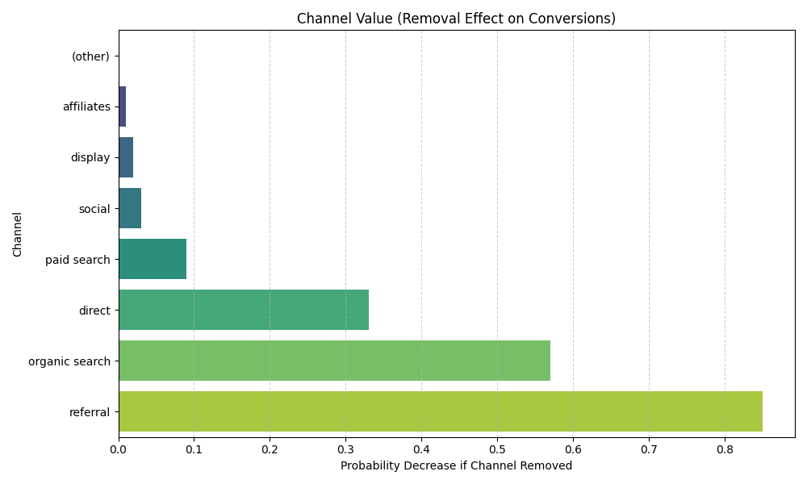

# Nexus — AI-Powered Marketing Attribution & Strategy

Nexus turns raw marketing data into budget decisions. Upload two CSVs — a channel-level
user-journey export (Google Analytics style) and a marketing-mix (spend/revenue) file — and
it runs a full attribution + marketing-mix-modeling pipeline, then writes a strategic report
you can hand to a CMO.

It combines **three independent models** and reconciles them, rather than trusting a single
attribution view:

- **Markov-chain attribution** — builds a transition matrix over the customer journey and
  measures each channel's **removal effect** (how many conversions are lost if the channel
  disappears) using the fundamental matrix `N = (I − Q)⁻¹`.
- **Shapley-value attribution** — game-theoretic credit sharing across the channels that
  co-occur on converting journeys.
- **Marketing-Mix Modeling (MMM)** — regresses spend against revenue to estimate
  incremental revenue and **ROI / ROAS** per channel.

These are fused with a **Bayesian prior synthesis** step that produces a consensus
attribution weight per channel together with an uncertainty band (sigma / confidence), and
the results are written up by an LLM into an executive report and exported to PDF.

---

## What it produces

- **ROI vs. Attribution table** — ROI, MMM revenue share, and consensus attribution weight per channel
- **Attribution uncertainty (forest) plot** — consensus weight with confidence intervals
- **Removal-effects chart** — the "load-bearing" channels
- **Customer-journey Sankey** — how traffic flows between channels toward conversion
- **Executive strategy report** — LLM-written, exported as PDF
- **Chat assistant** — ask questions against the computed attribution data

### Sample output





---

## Tech stack

- **Python** · pandas · numpy
- **Modeling** — Markov chains (removal effects via fundamental matrix), Shapley values, regression-based MMM
- **Visualization** — matplotlib, plotly (Sankey)
- **App** — Streamlit
- **Reporting** — LLM report generation + PDF export

---

## How to run

```bash
# 1. install dependencies
pip install -r requirements.txt

# 2. add your API key
echo "GEMINI_API_KEY=your_key_here" > .env

# 3. launch the app
streamlit run app.py
```

Then upload a Google-Analytics-style journey CSV and an MMM (spend/revenue) CSV in the
sidebar and click **Run Analysis**. Sample data is in [`data/`](data/).

---

## Project structure

```
app.py                     # Streamlit UI (dashboard, visuals, report, chat)
run_pipeline.py            # CLI entry point for the pipeline
src/
  main.py                  # pipeline orchestrator
  markov_shapley.py        # Markov transition matrix, removal effects, Shapley, top paths
  attr_synthesis.py        # Bayesian synthesis of Markov + Shapley into a consensus prior
  mmm.py                   # marketing-mix model → ROI / incremental revenue
  viz_forest.py            # attribution uncertainty (forest) plot
  viz_report.py            # Q/R-matrix and removal-effect charts
  viz.py                   # customer-journey Sankey
  llm_analyst.py           # LLM report + chat
  pdf_generator.py         # PDF export
data/                      # sample GA + MMM inputs
output/                    # generated charts and reports
```

---

## How it works (pipeline)

1. **Journeys** — sessions are aggregated into per-user channel paths.
2. **Markov** — a transition matrix is built; removal effects rank each channel's importance.
3. **Shapley** — converting coalitions share credit across participating channels.
4. **Synthesis** — Markov and Shapley are combined into a consensus attribution weight with an uncertainty band.
5. **MMM** — spend is regressed on revenue to estimate ROI / incremental revenue per channel.
6. **Report** — the consensus attribution, ROI, and journey structure are written up as a strategic report and exported to PDF.

---

*Built as a portfolio project exploring how attribution, MMM, and Bayesian reasoning can be combined into a single budget-allocation tool.*
